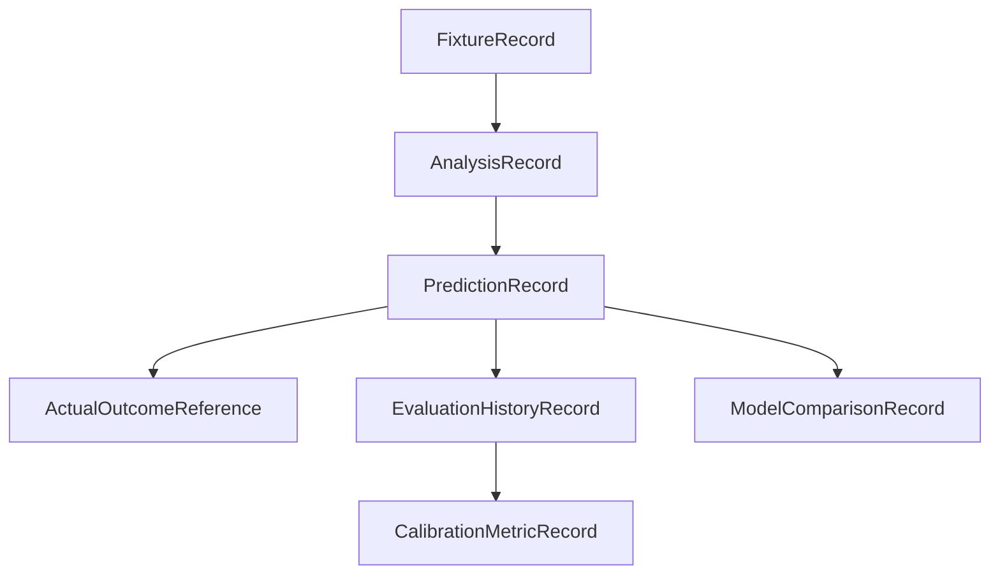

# Longitudinal evaluation records

Stage 2 adds immutable Python schemas in `modelfc.evaluation_records`. They
are an extension point for future evaluation and comparison work. They do not
add retraining, calibration jobs, settlement, or a new HTTP dependency.

The first usable product should keep its operational scope narrow: real
upcoming Championship fixtures, messy multi-fixture input, team-corner and
match-corner normalization, deterministic analysis, automatic result
retrieval, and performance tracking. These record shapes remain provider- and
market-agnostic so La Liga 2, other totals, player shots, and BTTS can be
added later without changing the core relationships.

## Record relationships

`FixtureRecord` preserves the provider fixture ID, competition, season,
kickoff, provider snapshot ID, historical-data snapshot hash, and data-snapshot
version. An `AnalysisRecord` preserves the data-snapshot, feature-set, and
model versions plus the analysis and input cutoffs. Each `PredictionRecord`
additionally preserves the prediction-schema version, market, line, American
odds, probabilities, prediction timestamp, and settlement state. The original
prediction fields are immutable; later outcome and evaluation records
reference them instead of rewriting them.

`ActualOutcomeReference` is the future result-ingestion boundary. It preserves
the outcome-source version, requires both corner counts for a completed result,
and can represent postponed or cancelled outcomes without guessing.
`EvaluationHistoryRecord` records an evaluation-run version and scoring event.
`CalibrationMetricRecord` and `ModelComparisonRecord` provide stable places
for later metrics over a named, versioned dataset and evaluation run.

## Recorded Stage 2 evaluation

The versioned cases in
`tests/fixtures/fixture_resolution/evaluation_cases.json` are evaluated by
`run_recorded_evaluation` in `modelfc.fixture_grounding`. The current ten-case
report is reproducible from the recorded provider snapshot and responses:

| Metric | Result |
| --- | ---: |
| Exact fixture accuracy (resolved cases) | 0.40 |
| Field accuracy | 0.96 |
| Provider-grounded resolution rate | 0.20 |
| Correct abstention rate | 1.00 |
| Schema validity | 0.90 |
| Hallucination count | 2 |

This intentionally small set includes exact, ambiguous, unavailable, stale,
completed, postponed, unsupported, invented, conflicting, and snapshot-mismatch
cases. It is a contract and safety regression set, not a model-quality
benchmark. There is no LLM adapter in this stage, so token totals and estimated
spend are zero and no normalization-quality claim is made.

## Leakage prevention

Pre-kickoff analysis and prediction records require timezone-aware timestamps
and enforce:

* prediction or analysis time is strictly before kickoff;
* the input data cutoff is no later than the prediction or analysis time;
* every input snapshot's data cutoff is no later than the declared cutoff; and
* an input snapshot cannot be captured after the prediction timestamp.

This means a post-match result or a future historical refresh cannot be used by
accident in a pre-kickoff prediction record. The schemas do not infer or
silently repair timestamps.

## Production prerequisite

Stable records do not create a schedule provider. Production use still
requires a real upcoming-fixture provider with stable IDs, trusted kickoff
times, statuses, explicit competition and season coverage, retention terms,
and a verified refresh path for each enabled league. A local historical CSV
does not prove upcoming-fixture coverage. Do not advertise all-league support
until provider and historical-data coverage are configured and validated for
each league.
